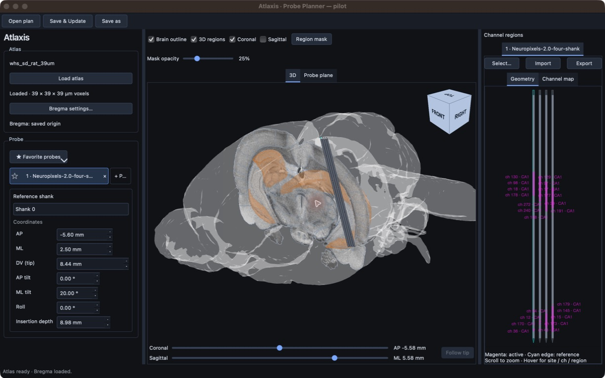
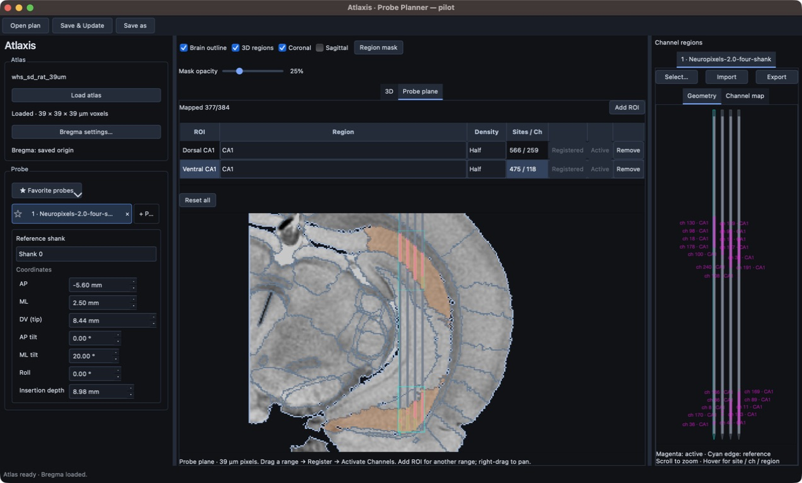

# Atlaxis

Plan electrophysiology probe placement and Neuropixels recording channels in a 3D brain atlas.

- **[BrainGlobe](https://github.com/brainglobe/brainglobe-atlasapi)** provides the atlas backend.
- **[NeuroCarto](https://neurocarto.readthedocs.io/en/latest/)** provides the Neuropixels channel-selection backend.

## Install

Standalone releases are being prepared. Once available, download your platform's
archive from [Releases](https://github.com/yoshihito-saito/Atlaxis/releases). No Python setup is required.

| Platform | Installation |
| --- | --- |
| macOS Apple Silicon | Unzip `Atlaxis-macOS-arm64.zip`, move **Atlaxis.app** to **Applications**, and open it. |
| Windows x64 | Extract `Atlaxis-Windows-x64.zip` and run **Atlaxis.exe**. Keep the entire extracted folder together. |

On first launch, choose a data folder (default: `Documents/Atlaxis`).
Atlases download on first use. Developers: [install from source](docs/development.md).

## Workflow

1. **Load atlas** and verify the Bregma origin.
2. **+ Probe** — choose a probe, check its wiring, and set position, tilt and depth.
3. Select Neuropixels channels as below, then **Save & Update** to save the plan.

## Probes

| Library | Layouts |
| --- | --- |
| Neuropixels | 1.0; 2.0 single- and four-shank |
| Cambridge NeuroTech | 171 models |
| NeuroNexus | Buzsaki, linear and Poly |
| Custom | JSON or CellExplorer MAT |

[Full probe library and wiring details](probes/README.md)

> **Always verify the channel map yourself before recording**, against your actual
> probe, headstage, adapter and acquisition setup.

## Neuropixels channel selection

1. Click **Select…**, draw an ROI, choose **Region** and **Density**, then **Register**.
2. **Activate Channels** uses NeuroCarto to select sites within the ROI. Activate
   priority ROIs first; **Add ROI** adds another range while keeping existing assignments.
3. **Export → IMRO + selection**, then load the `.imro` in
   [Open Ephys](https://open-ephys.github.io/gui-docs/User-Manual/Plugins/Neuropixels-PXI.html#imro-files)
   or [SpikeGLX](https://billkarsh.github.io/SpikeGLX/help/imroTables/).

IMRO fills all 384 channels, including additional sites outside your ROIs when needed.
The CSV marks targets with `is_target=1`; `.selection.json` restores your ROI selection.

Licensed under [GNU GPL v3.0](LICENSE.md). See [third-party notices](THIRD_PARTY_NOTICES.md).
